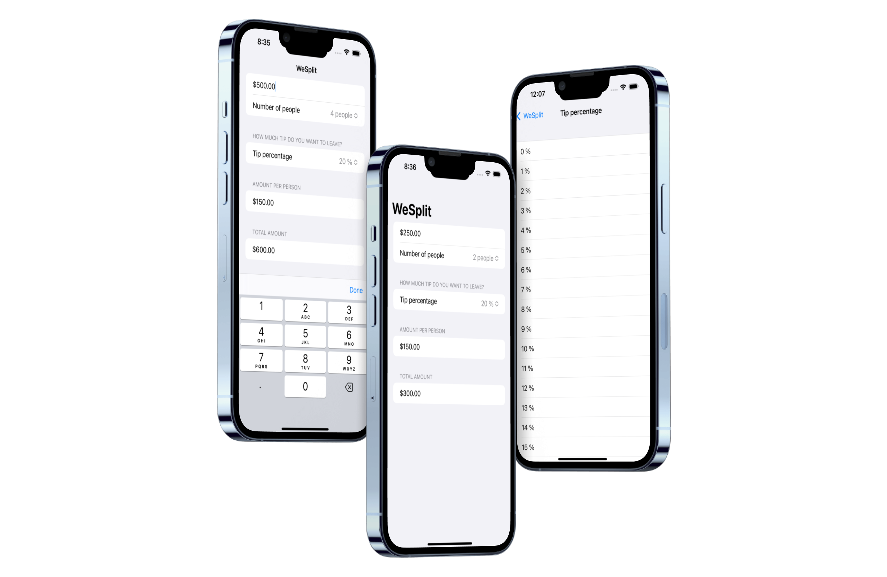

  <h1>WeSplit</h1>
  <samp>Project 1</samp>
   

  
    Author: <a href="https://github.com/plskz" target="_blank">Zai Santillan</a>
     
    <small>December 5, 2022 - Monday</small>
  

[<< Home](https://github.com/plskz/100SwiftUI/) | [02-Challenge Day >>](../02-Challenge%20Day/)

## 📝 What I learned

Form, Section, NavigationView, @State, @FocusState, TextField, Picker, ForEach

[Excalidraw - Day 18](https://dub.sh/plskz-100swiftui-wesplit)

## 🏆 Challenges

> 1. Add a header to the third section, saying “Amount per person”
> 1. Add another section showing the total amount for the check – i.e., the original amount plus tip value, without dividing by the number of people.
> 1. Change the tip percentage picker to show a new screen rather than using a segmented control, and give it a wider range of options – everything from 0% to 100%. Tip: use the range `0..<101` for your range rather than a fixed array.

## 📷 Screenshots

## Resources

- [Hacking with Swift - WeSplit](https://www.hackingwithswift.com/books/ios-swiftui/wesplit-wrap-up)
- https://developer.apple.com/documentation/SwiftUI/FocusState
- https://developer.apple.com/documentation/swiftui/view/keyboardtype(_:)
- [stackoverflow - SwiftUI Picker in Forms (iOS 16)](https://stackoverflow.com/questions/73896801/swiftui-picker-in-forms-ios-16)

[<< Home](https://github.com/plskz/100SwiftUI/) | [02-Challenge Day >>](../02-Challenge%20Day/)
