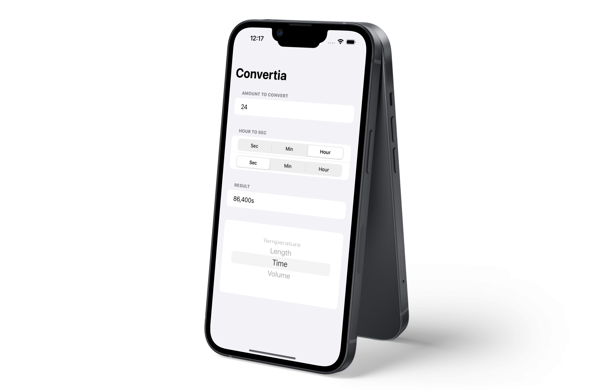

  <h1>Unit Converter</h1>
  <samp>Challenge Day</samp>
   

  
    Author: <a href="https://github.com/plskz" target="_blank">Zai Santillan</a>
     
    <small>December 6, 2022 - Tuesday</small>
  

[<< 01-WeSplit](../01-WeSplit/) | [03-Guess the Flag >>](../03-Guess%20the%20Flag/)

## 📝 What I Learned

Dimension (UnitTemperature, UnitLength, UnitDuration, UnitVolume), Custom modifiers

[Excalidraw - Day 19](https://dub.sh/plskz-100swiftui-challenge-day)

## 🏆 Challenges

> You need to build an app that handles unit conversions: users will select an input unit and an output unit, then enter a value, and see the output of the conversion.
>
> Which units you choose are down to you, but you could choose one of these:
>
> - Temperature conversion: users choose Celsius, Fahrenheit, or Kelvin.
> - Length conversion: users choose meters, kilometers, feet, yards, or miles.
> - Time conversion: users choose seconds, minutes, hours, or days.
> - Volume conversion: users choose milliliters, liters, cups, pints, or gallons.

Note: I decided to combine them together to challenge myself.

## 📷 Screenshots

## Resources

- [Hacking with Swift - Challenge Day](https://www.hackingwithswift.com/100/swiftui/19)
- https://www.hackingwithswift.com/example-code/system/how-to-convert-units-using-unit-and-measurement
- https://www.hackingwithswift.com/books/ios-swiftui/custom-modifiers

[<< 01-WeSplit](../01-WeSplit/) | [03-Guess the Flag >>](../03-Guess%20the%20Flag/)
