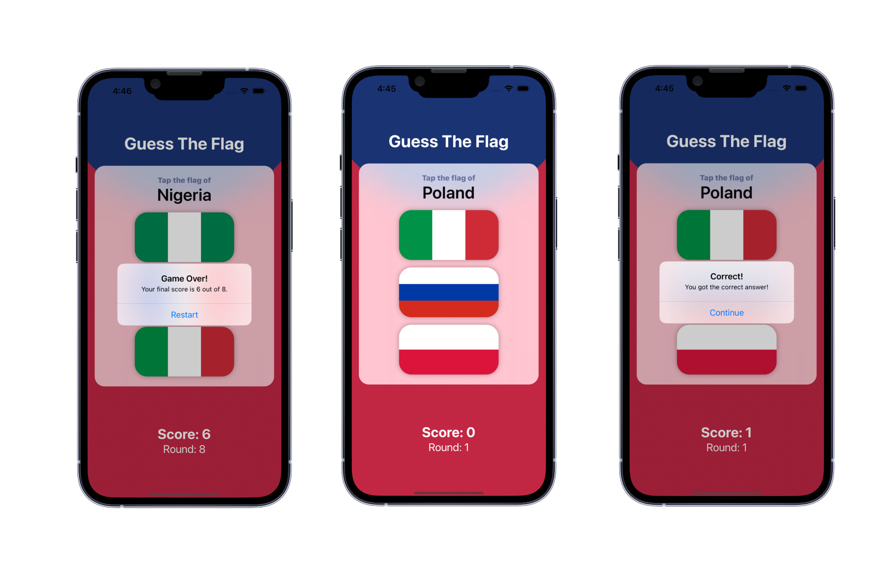

  <h1>Guess the Flag</h1>
  <samp>Project 2</samp>
   

  
    Author: <a href="https://github.com/plskz" target="_blank">Zai Santillan</a>
     
    <small>Dec 9, 2023 - Friday</small>
  

[<< 02-Challenge Day](../02-Challenge%20Day/) | [04-Views and Modifiers >>](../04-Views%20and%20Modifiers/)

## 📝 What I Learned

Stacks, Buttons, Images, Alerts, LinearGradient

[Excalidraw - Day 20 to Day 22](https://dub.sh/plskz-100swiftui-guesstheflag)

## 🏆 Challenges

> 1. Add an @State property to store the user’s score, modify it when they get an answer right or wrong, then display it in the alert and in the score label.
>
>    🔗 [Solution](https://github.com/plskz/100SwiftUI/pull/3/commits/2c56e0973ca07a40e5508a6e195d6da66e671dec)
>
> 1. When someone chooses the wrong flag, tell them their mistake in your alert message – something like “Wrong! That’s the flag of France,” for example.
>
>    🔗 [Solution](https://github.com/plskz/100SwiftUI/pull/3/commits/035cefac091429e331d8fc30fb45fe2a98dc0d38)
>
> 1. Make the game show only 8 questions, at which point they see a final alert judging their score and can restart the game.
>
>    🔗 [Solution](https://github.com/plskz/100SwiftUI/pull/3/commits/40f8648e8a6bfcc98e90c3167797bed2cf8e0117)

## 📷 Screenshots

## Resources

- [Hacking with Swift - Guess The Flag](https://www.hackingwithswift.com/books/ios-swiftui/guess-the-flag-wrap-up)
- https://www.hackingwithswift.com/quick-start/swiftui/swiftuis-built-in-shapes

[<< 02-Challenge Day](../02-Challenge%20Day/) | [04-Views and Modifiers >>](../04-Views%20and%20Modifiers/)
