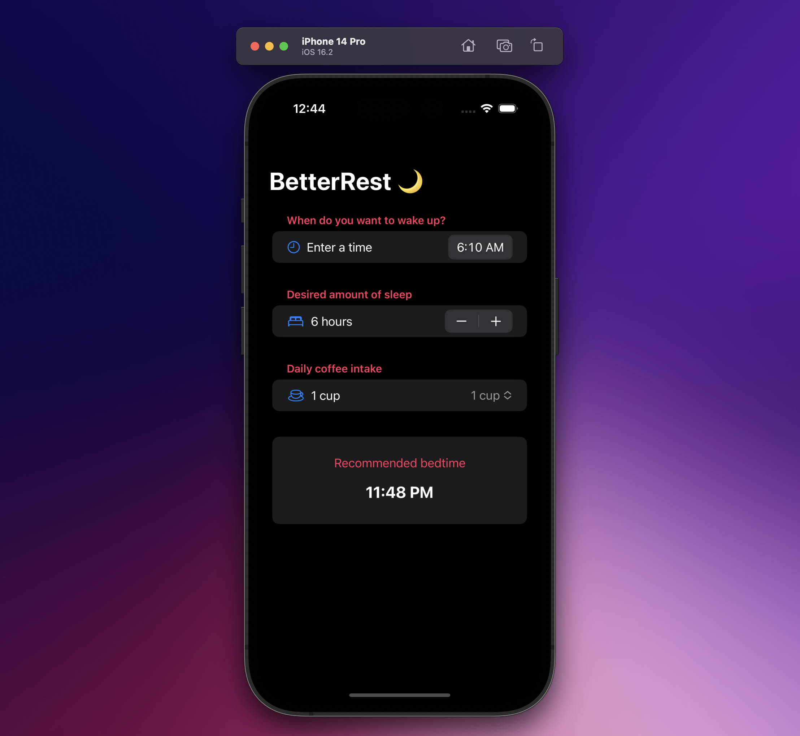

  <h1>BetterRest</h1>
  <samp>Project 4</samp>
   

  
    Author: <a href="https://github.com/plskz" target="_blank">Zai Santillan</a>
     
    <small>Dec 20, 2022 - Tuesday</small>
  

[<< 05-Milestone 1](../05-Milestone%201/) | [07-WordScramble >>](../07-WordScramble/)

## 📝 What I Learned

DatePicker, Stepper, Date, DateComponents, DateFormatter, Create ML, Core ML

[Excalidraw - Day 26 to 28](https://dub.sh/plskz-100swiftui-betterrest)

## 🏆 Challenges

> 1. Replace each `VStack` in our form with a `Section`, where the text view is the title of the section. Do you prefer this layout or the `VStack` layout? It’s your app – you choose!
>
>    🔗 [Solution](https://github.com/plskz/100SwiftUI/pull/4/commits/fa2161b7e4d02e7853422d5cb18a8dc6610402d0)
>
> 1. Replace the “Number of cups” stepper with a `Picker` showing the same range of values.
>
>    🔗 [Solution](https://github.com/plskz/100SwiftUI/pull/4/commits/b711d28210eb3db2d8c3d060d939442bac4a4eaa)
>
> 1. Change the user interface so that it always shows their recommended bedtime using a nice and large font. You should be able to remove the “Calculate” button entirely.
>
>    🔗 [Solution](https://github.com/plskz/100SwiftUI/pull/4/commits/0d008fcd3c1bebce364d9ae3d3461cbd6abb5b92)

## 📷 Screenshots

## Resources

- [Hacking with Swift - BetterRest (Challenge)](https://www.hackingwithswift.com/books/ios-swiftui/betterrest-wrap-up)

[<< 05-Milestone 1](../05-Milestone%201/) | [07-WordScramble >>](../07-WordScramble/)
