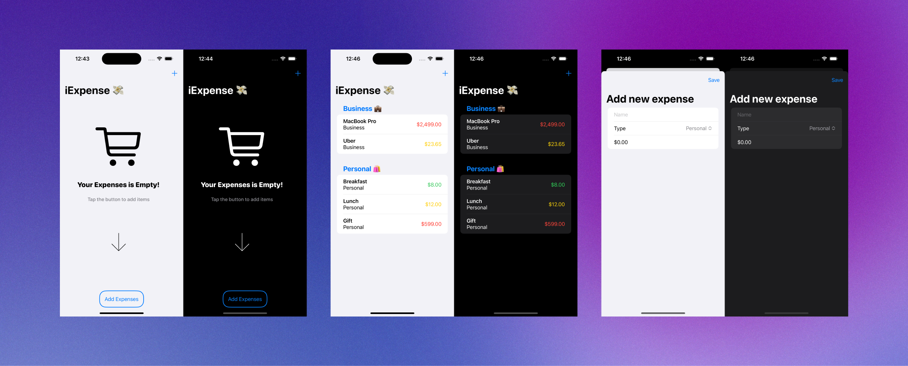
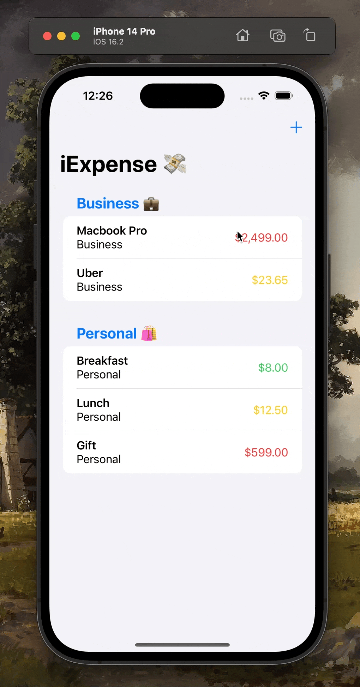

  <h1>iExpense</h1>
  <samp>Project 7</samp>
   

  
    Author: <a href="https://github.com/plskz" target="_blank">Zai Santillan</a>
     
    <small>Feb 10, 2023 - Friday</small>
  

[<< 09-Milestone 2](../09-Milestone%202/) | [11-Moonshot >>](../11-Moonshot/)

## 📝 What I Learned

UserDefaults, @AppStorage, Codable, sheet(), onDelete(), @StateObject, @ObservedObject, @Published

[Notes - Day 36 to 38](https://dub.sh/plskz-100swiftui-iexpense)

## 🏆 Challenges

> 1. Use the user’s preferred currency, rather than always using US dollars.
>
>    🔗 [Solution](https://github.com/plskz/100SwiftUI/pull/7/commits/e9b3d963f529112ce56b191ed797dde8c5b6b4b8)
>
> 1. Modify the expense amounts in **ContentView** to contain some styling depending on their value – expenses under $10 should have one style, expenses under $100 another, and expenses over $100 a third style. What those styles are depend on you.
>
>    🔗 [Solution](https://github.com/plskz/100SwiftUI/pull/7/commits/409c3033a146811056f05fa56c52dcf17f08294b)
>
> 1. For a bigger challenge, try splitting the expenses list into two sections: one for personal expenses, and one for business expenses. This is tricky for a few reasons, not least because it means being careful about how items are deleted!
>
>    🔗 [Solution](https://github.com/plskz/100SwiftUI/pull/7/commits/93bfd1f72b2c282802a38262afb3e8645579b0a5)

→ [Pull Request](https://github.com/plskz/100SwiftUI/pull/7)

## 📷 Screenshots

## Resources

- [Hacking with Swift - iExpense (Challenge)](https://www.hackingwithswift.com/books/ios-swiftui/iexpense-wrap-up)
- [EmptyList](./iExpense/iExpense/EmptyList.swift) inspiration
  - [Empty states [e-commerce] by Victor Nzedu on Dribbble](https://dribbble.com/shots/17202945-Empty-states-e-commerce)
  - [Trendy E-commerce App UI kit by Chih-Yun Cheng on Dribbble](https://dribbble.com/shots/7206848-Trendy-E-commerce-App-UI-kit)
- [json - Filtering a For Each loop - swiftui](https://stackoverflow.com/questions/65025775/filtering-a-for-each-loop-swiftui)
- [SOLVED: Background Color of a list, make it clear color.](https://www.hackingwithswift.com/forums/swiftui/background-color-of-a-list-make-it-clear-color/3379/3384)
- [How to change SwiftUI font size | Sarunw](https://sarunw.com/posts/how-to-change-swiftui-font-size/)

[<< 09-Milestone 2](../09-Milestone%202/) | [11-Moonshot >>](../11-Moonshot/)
